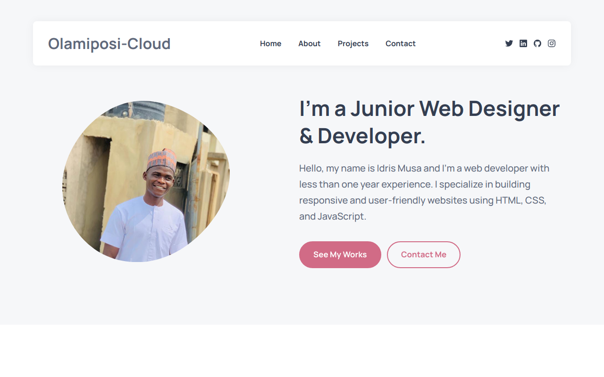

  <h2 align="center">olamiposi - Portfolio Website</h2>

  A fully responsive personal portfolio website, <br />Responsive for all devices, build using HTML, CSS, and JavaScript.

  <a href="https://personal-portfolio-blue-five.vercel.app/"><strong>➥ Live Demo</strong></a>

</div>

<br />

### Demo Screeshots



### Prerequisites

Before you begin, ensure you have met the following requirements:

* [Git](https://git-scm.com/downloads "Download Git") must be installed on your operating system.

### Run Locally

To run **olamiposi** locally, run this command on your git bash:

Linux and macOS:

```bash
sudo git clone https://github.com/Olamiposi-cloud-coder/Personal-Portfolio.git
```

Windows:

```bash
git clone https://github.com/Olamiposi-cloud-coder/Personal-Portfolio.git
```

### Contact

If you want to contact with me you can reach me at [Twitter](https://twitter.com/Olamiposi_Cloud).

### License

This project is **free to use** and does not contains any license.
